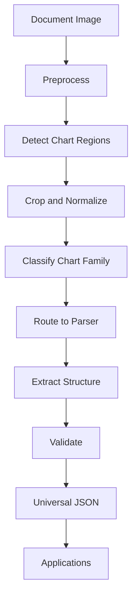
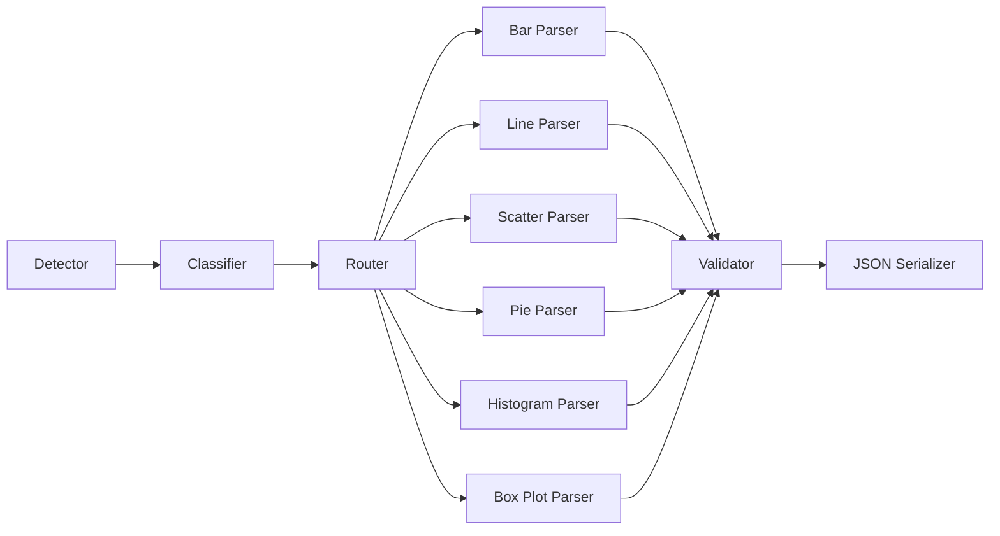
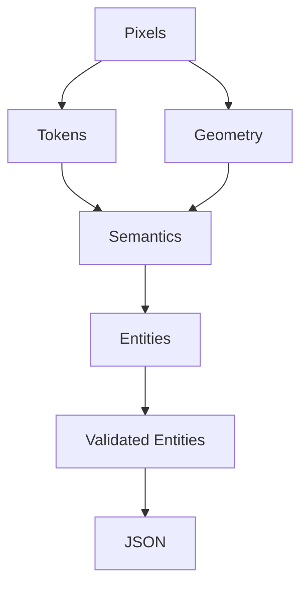
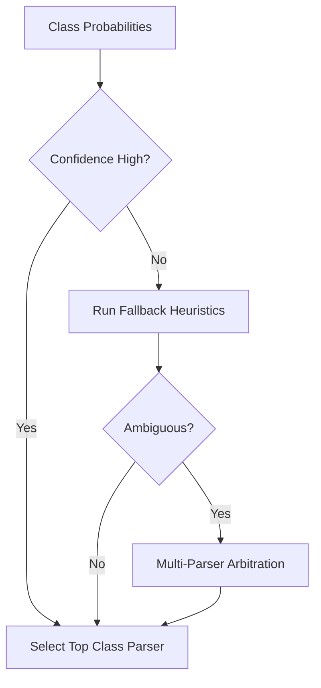
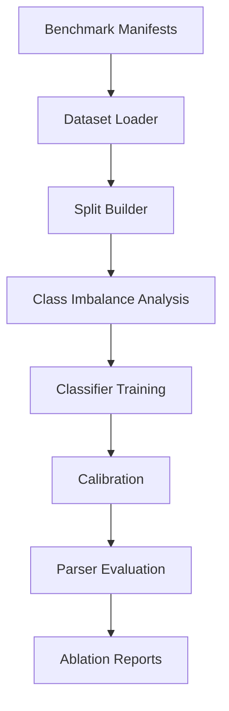
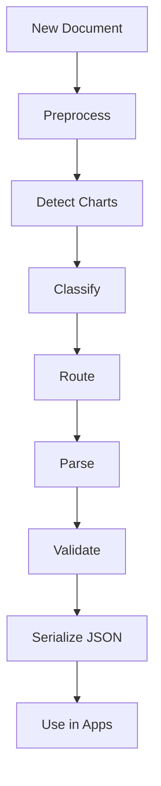

# Architecture Diagrams

## 1. Overall Pipeline

```mermaid
flowchart TD
    A["Document Image"] --> B["Preprocess"]
    B --> C["Detect Chart Regions"]
    C --> D["Crop and Normalize"]
    D --> E["Classify Chart Family"]
    E --> F["Route to Parser"]
    F --> G["Extract Structure"]
    G --> H["Validate"]
    H --> I["Universal JSON"]
    I --> J["Applications"]
```

## 2. Module Interaction

```mermaid
flowchart LR
    Det["Detector"] --> Cls["Classifier"]
    Cls --> Rtr["Router"]
    Rtr --> Bar["Bar Parser"]
    Rtr --> Line["Line Parser"]
    Rtr --> Scat["Scatter Parser"]
    Rtr --> Pie["Pie Parser"]
    Rtr --> Hist["Histogram Parser"]
    Rtr --> Box["Box Plot Parser"]
    Bar --> Val["Validator"]
    Line --> Val
    Scat --> Val
    Pie --> Val
    Hist --> Val
    Box --> Val
    Val --> Json["JSON Serializer"]
```

## 3. Data Flow

```mermaid
flowchart TD
    P["Pixels"] --> T["Tokens"]
    P --> G["Geometry"]
    T --> S["Semantics"]
    G --> S
    S --> E["Entities"]
    E --> V["Validated Entities"]
    V --> J["JSON"]
```

## 4. Parser Routing

```mermaid
flowchart TD
    A["Class Probabilities"] --> B{"Confidence High?"}
    B -- Yes --> C["Select Top Class Parser"]
    B -- No --> D["Run Fallback Heuristics"]
    D --> E{"Ambiguous?"}
    E -- No --> C
    E -- Yes --> F["Multi-Parser Arbitration"]
    F --> C
```

## 5. Training Pipeline

```mermaid
flowchart TD
    A["Benchmark Manifests"] --> B["Dataset Loader"]
    B --> C["Split Builder"]
    C --> D["Class Imbalance Analysis"]
    D --> E["Classifier Training"]
    E --> F["Calibration"]
    F --> G["Parser Evaluation"]
    G --> H["Ablation Reports"]
```

## 6. Inference Pipeline

```mermaid
flowchart TD
    A["New Document"] --> B["Preprocess"]
    B --> C["Detect Charts"]
    C --> D["Classify"]
    D --> E["Route"]
    E --> F["Parse"]
    F --> G["Validate"]
    G --> H["Serialize JSON"]
    H --> I["Use in Apps"]
```

